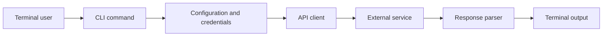

<!-- unified-readme:start -->
<div align="center">

# Blink CLI

**CLI tool for controlling and monitoring Blink security cameras.**

Build. Automate. Share.

[](https://github.com/JayRHa/BlinkCLI/stargazers)
[](https://github.com/JayRHa/BlinkCLI/network/members)
[](https://github.com/JayRHa/BlinkCLI/issues)
[](https://github.com/JayRHa/BlinkCLI/graphs/contributors)

<h1>Blink CLI</h1>
  <p><strong>Operate Blink systems and cameras from your terminal with clean JSON for automation.</strong></p>
  <p>
    
    
    
    
  </p>

---

`CLI Tool` | `Python` | `Public` | `Maintained`

</div>

## What is this?

Blink CLI wraps a service or workflow in a command-line interface so common tasks can be automated from a terminal, shell script, or scheduled job.

## Project Context

- Primary stack: Python.
- Typical usage starts with local configuration or credentials, then executes commands against the target service API.
- This repository is maintained as a practical project and reference asset.

## How It Works

The CLI parses user input, loads configuration, calls the external service, normalizes the response, and prints script-friendly output.



## Quick Start

1. Review the project context and workflow below.
2. Clone the repository:

   ```bash
   git clone https://github.com/JayRHa/BlinkCLI.git
   ```

3. Continue with the setup, usage, or workflow sections below.

---
<!-- unified-readme:end -->

## Overview

`blink` is a high-signal command line tool for:

- listing Blink sync modules and cameras
- arming/disarming systems and cameras
- triggering snapshots and exporting image/video files
- clean machine-readable JSON for pipelines
- fast terminal-first human output

## 60-Second Quickstart

```bash
python3 -m venv .venv
source .venv/bin/activate
python3 -m pip install -e .
export BLINK_USERNAME="you@example.com"
export BLINK_PASSWORD="<YOUR_PASSWORD>"

blink systems
blink cameras --json
blink camera-arm --camera "Front Door" --state armed
```

## Why It Feels Great To Use

- Single command surface: `blink`
- Strict argument validation with clear errors
- Human view for operators, JSON view for automation
- Case-insensitive camera/system targeting
- Predictable exit codes for CI and scripts

## Install

```bash
python3 -m pip install -e .
```

If your Python is externally managed, use a virtualenv (recommended).

## Authentication

Use one of these:

```bash
blink --username "you@example.com" --password "<PASSWORD>" systems
```

```bash
export BLINK_USERNAME="you@example.com"
export BLINK_PASSWORD="<PASSWORD>"
blink systems
```

You can also reuse an auth/session file:

```bash
blink --auth-file ~/.config/blink/auth.json systems
blink save-auth --path ~/.config/blink/auth.json
```

## Command Matrix

| Command | Purpose | Common flags |
| --- | --- | --- |
| `systems` | List sync modules | `--json` |
| `cameras` | List cameras | `--system`, `--json` |
| `refresh` | Force a fresh account snapshot | `--force`, `--json` |
| `system-arm` | Arm/disarm a sync module | `--system`, `--state` |
| `camera-arm` | Arm/disarm a camera | `--camera`, `--state` |
| `trigger-camera` | Trigger camera snapshot | `--camera` |
| `save-image` | Save camera image to file | `--camera`, `--path`, `--trigger` |
| `save-video` | Save latest video to file | `--camera`, `--path` |
| `download-videos` | Download videos to directory | `--path`, `--camera`, `--since` |
| `save-auth` | Persist current auth/session data | `--path` |

## Usage Examples

### `systems`

```bash
blink systems
blink systems --json
```

### `cameras`

```bash
blink cameras
blink cameras --system "Home Sync" --json
```

### `refresh`

```bash
blink refresh
blink refresh --force --json
```

### `system-arm`

```bash
blink system-arm --system "Home Sync" --state armed
blink system-arm --system "Home Sync" --state disarmed --json
```

### `camera-arm`

```bash
blink camera-arm --camera "Front Door" --state armed
blink camera-arm --camera "Garage" --state disarmed --json
```

### `trigger-camera`

```bash
blink trigger-camera --camera "Front Door"
blink trigger-camera --camera "Backyard" --json
```

### `save-image`

```bash
blink save-image --camera "Front Door" --path ./out/front.jpg
blink save-image --camera "Front Door" --path ./out/front.jpg --trigger --refresh
```

### `save-video`

```bash
blink save-video --camera "Front Door" --path ./out/front.mp4
blink save-video --camera "Garage" --path ./out/garage.mp4 --refresh --json
```

### `download-videos`

```bash
blink download-videos --path ./downloads
blink download-videos --path ./downloads --camera "Front Door" --since "2026-02-01T00:00:00Z"
```

### `save-auth`

```bash
blink save-auth --path ~/.config/blink/auth.json
blink --username "you@example.com" --password "<PASSWORD>" save-auth --path ./blink-auth.json
```

## Automation Recipes

Count armed cameras:

```bash
blink cameras --json | jq '[.cameras[] | select(.armed == true)] | length'
```

Export camera names and battery values:

```bash
blink cameras --json | jq -r '.cameras[] | [.name, .battery_pct] | @tsv'
```

Arm one system from a script:

```bash
blink system-arm --system "Home Sync" --state armed --json | jq -r '.system.armed'
```

## Exit Codes

| Code | Meaning |
| --- | --- |
| `0` | Success |
| `1` | API/network/runtime error |
| `2` | Input/auth/rate-limit error |

## Troubleshooting

`Input error: Authentication missing`
Use `--auth-file` or provide both `--username` and `--password`.

`Error: Two-factor verification required`
Retry with `--pin <CODE>` or `BLINK_PIN`.

`Error: Invalid credentials or verification failed`
Check email/password/PIN and account region.

`Error: Request limit exceeded`
Blink cloud rate-limit hit; retry later.

## Developer Notes

Run from source:

```bash
PYTHONPATH=src python3 -m blink_cli --help
```

Compile check:

```bash
python3 -m compileall -q src tests
```

Tests:

```bash
PYTHONPATH=src python3 -m pytest -q
```

## Project Structure

```text
src/blink_cli/
  cli.py           # parsing, command execution, output rendering
  transform.py     # normalization layer
  const.py         # constants and error-hint mappings
  __main__.py      # python -m entrypoint
tests/
  test_transform.py
```

## Security

- Never commit Blink credentials or auth files.
- Prefer environment variables in CI/CD.
- Treat auth JSON as sensitive secret material.
- Rotate password and revoke sessions immediately if exposed.
